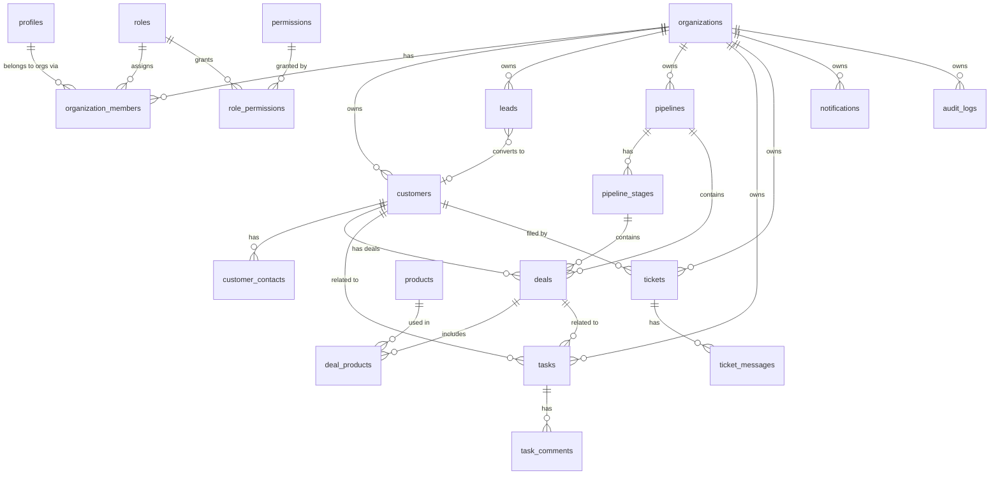

# Database

NEXORA's database is PostgreSQL, provisioned and managed through Supabase. Schema is defined as
plain SQL migrations in [`database/migrations/`](../database/migrations), applied in filename
order (`0001_...sql`, `0002_...sql`, …). There is no ORM — the API talks to Postgres through the
Supabase client and hand-written queries, keeping the schema, indexes, and constraints as the
single source of truth.

## Applying migrations

**Local (Supabase CLI):**

```bash
supabase start          # boots local Postgres + Auth + Studio
supabase db reset       # (re)applies every migration in database/migrations, in order
```

**Hosted Supabase project:** paste each migration file's contents into the SQL editor in order,
or use `supabase db push` once the CLI is linked to the project (`supabase link`).

## Multi-tenancy model

Every business-data table carries an `organization_id` foreign key into `organizations`. There is
no cross-tenant table. Membership is resolved from the authenticated user via
`organization_members`, never trusted from client input — see
[authorization.md](./authorization.md) and [security.md](./security.md).

Two `security definer` SQL functions back every Row Level Security policy:

- `is_org_member(org_id)` — true if `auth.uid()` is an `ACTIVE` member of the organization.
- `has_permission(org_id, permission_key)` — true if `auth.uid()`'s role in that organization
  grants the given permission key (via `role_permissions`).

RLS is enabled on every tenant table; see [`0012_row_level_security.sql`](../database/migrations/0012_row_level_security.sql)
and [authorization.md](./authorization.md) for the full policy design.

## Schema overview



## Table reference

| Table                                    | Purpose                                                                                                                                          |
| ---------------------------------------- | ------------------------------------------------------------------------------------------------------------------------------------------------ |
| `profiles`                               | One row per Supabase auth user; mirrors `auth.users` for app-visible profile data. Auto-created via `handle_new_auth_user()` trigger on signup.  |
| `organizations`                          | The tenant boundary.                                                                                                                             |
| `organization_members`                   | Join table: which users belong to which organizations, with what role and status (`ACTIVE`/`INVITED`/`DEACTIVATED`).                             |
| `roles`                                  | Fixed, system-defined roles: `OWNER`, `ADMIN`, `MANAGER`, `SALES`, `SUPPORT`, `MEMBER`.                                                          |
| `permissions`                            | Granular `resource.action` permission keys (e.g. `customers.create`).                                                                            |
| `role_permissions`                       | The permission matrix mapping each role to its granted permissions.                                                                              |
| `customers`, `customer_contacts`         | CRM customer accounts and their contacts.                                                                                                        |
| `leads`, `lead_sources`, `lead_statuses` | Lead funnel (`NEW` → … → `WON`/`LOST`).                                                                                                          |
| `pipelines`, `pipeline_stages`           | Configurable sales pipelines and their ordered stages.                                                                                           |
| `deals`, `deal_products`, `products`     | Deals moving through a pipeline, with optional line-item products.                                                                               |
| `tasks`, `task_comments`                 | Task management, optionally linked to a customer or deal.                                                                                        |
| `activities`, `notes`                    | Polymorphic timeline entries and freeform notes attached to a customer, lead, or deal.                                                           |
| `tickets`, `ticket_messages`             | Support ticketing with a threaded conversation.                                                                                                  |
| `notifications`                          | Per-user notifications; never visible cross-user.                                                                                                |
| `audit_logs`                             | Append-only activity trail. Insert is open to any active member; select requires `settings.manage`. No update/delete policy exists for any role. |
| `tags`, `entity_tags`                    | Shared tagging, polymorphically attached to customers/leads/deals/tasks/tickets.                                                                 |
| `saved_filters`, `dashboard_widgets`     | Per-user (optionally org-shared) saved views and dashboard layout.                                                                               |
| `user_preferences`                       | Per-user theme, active-organization state, and `notification_settings` (per-type in-app notification toggles).                                   |
| `organization_settings`                  | Org-level configuration (currency, date format, branding).                                                                                       |
| `subscriptions`                          | Plan and billing status per organization.                                                                                                        |

## Soft deletes

Tables where "delete" is a recoverable, user-facing action (`customers`, `leads`, `deals`,
`tasks`, `tickets`) use a nullable `deleted_at timestamptz` column instead of a hard `DELETE`.
Application queries filter `deleted_at is null` for active records; archived/restore flows toggle
this column. Join/lookup tables and audit data do not use soft delete.

## Database functions

- `bootstrap_organization(name, slug)` — creates an organization, makes the caller its `OWNER`,
  and seeds default settings, subscription, and a starter sales pipeline, in one transaction.
- `convert_lead(lead_id, create_deal, ...)` — converts a lead into a customer and primary contact
  (optionally a deal), while preserving the original lead row with `converted_customer_id` set.
- `global_search(organization_id, query, limit)` — trigram-ranked search across customers, leads,
  deals, tasks, and tickets in one round trip. Checks organization membership and, per entity
  type, the matching `.read` permission itself, so a caller only ever sees rows they could already
  fetch one-by-one.

Both run as `security definer` because they write across multiple tenant-scoped tables in a single
transaction; each independently re-checks the caller's permissions before writing.

## Realtime

The `notifications` table is added to the `supabase_realtime` publication
([`0014_notifications_realtime.sql`](../database/migrations/0014_notifications_realtime.sql)) so
the frontend can subscribe to new rows via Supabase Realtime instead of polling. Supabase enforces
the same Row Level Security policies on `postgres_changes` subscriptions as on regular queries, so
a client can only ever receive its own (`user_id = auth.uid()`) notification inserts — adding the
table to the publication does not widen who can see a row, it only adds live delivery on top of
the existing per-user read policy.
